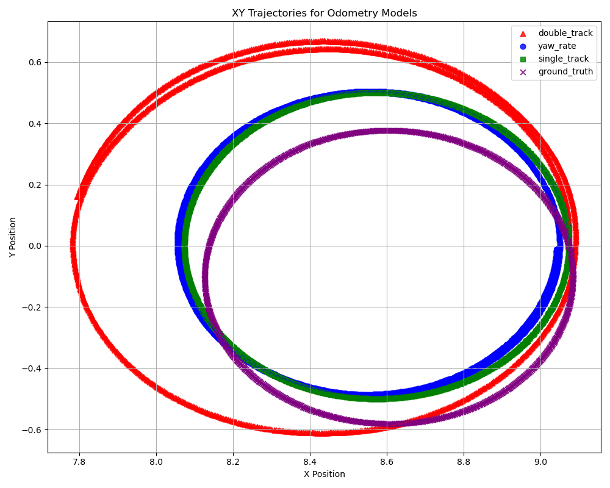
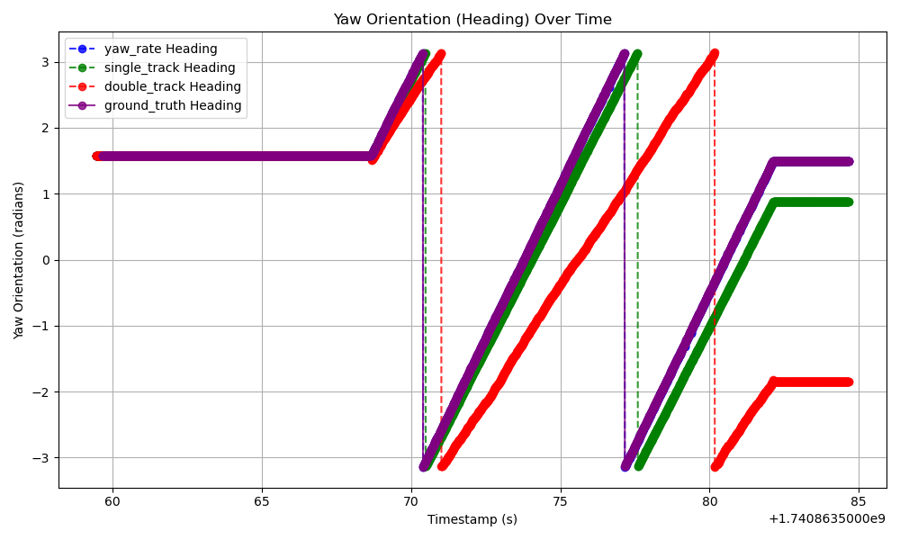
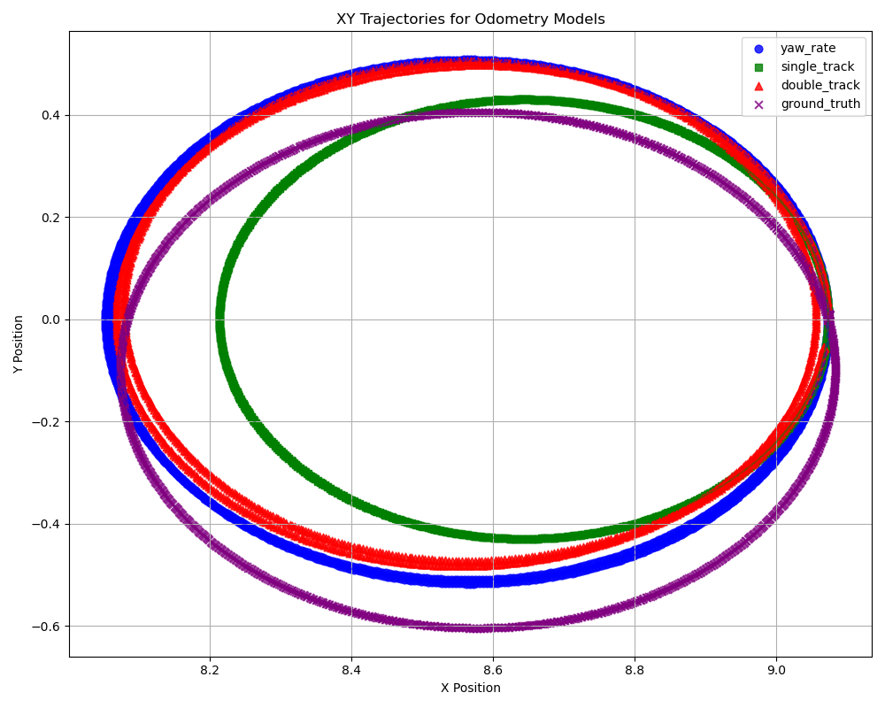
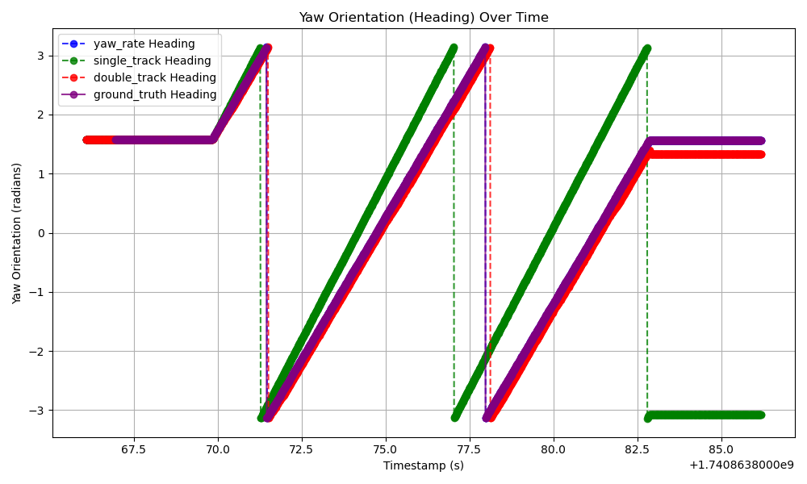

# FRA532 Mobile Robot

## Table of Contents
- [System Overview](#system-overview)
- [Installation](#installation)
- [LAB 1.1](#lab-11)
    - [Create Robot Model](#create-robot-model)
    - [Inverse Kinematics](#inverse-kinematics)
    - [Forward Kinematics](#forward-kinematics)
    - [Methodology and Results lab 1.1](#methodology-and-results-lab-11)  
- [LAB 1.2](#lab-12)
    - [PID Controller](#pid-controller)
    - [Pure Pursuit Controller](#pure-pursuit-controller)
    - [Stanley Controller](#stanley-controller)
    - [Methodology and Results lab 1.2](#methodology-and-results-lab-12)

- [LAB 1.3](#lab-13)

- [Our Team](#our-team)
- [References](#references)


## System Overview


## Installation

### Step 1: Create Workspace
```bash
mkdir -p ~/FRA532_MobileRobot/src
```

### Step 2: Clone the Repository
```bash
cd ~/FRA532_MobileRobot/src
git clone https://github.com/peeradonmoke2002/FRA532_LAB1_6702_6703.git
```

### Step 3: Build Workspace
```bash
cd ~/FRA532_MobileRobot
colcon build
source install/setup.bash
```

### Testing Rviz View and Gazebo Simulation

1) Build workspace

```bash
cd ~/FRA532_MobileRobot

sudo apt update

sudo apt install -y python3-rosdep

rosdep update --rosdistro=humble

rosdep install --from-paths src --ignore-src -r -y --rosdistro humble

colcon build

source install/setup.bash
```

2) Run launch file
```bash
ros2 launch limo_description sim.launch.py
```

It should show the Rviz view and Gazebo simulation as seen in the figure below:


## LAB 1.1
> [!NOTE]  
> - The lab 1.1 package folder is `~/FRA532_MobileRobot/src/FRA532_LAB1_6702_6703/robot_controller`
> - For Robot Model package are locate at `~/FRA532_MobileRobot/src/FRA532_LAB1_6702_6703/limo_description`

### Create Robot Model

#### Robot Dimension


Based on the robot dimensions set in this lab, you need to configure the following parameters in `limo_description` as shown below:

- **Wheel base:** `0.2 m`
- **Wheel radius:** `0.045 m`
- **Wheel length:** `0.001 m`
- **Track width:** `0.13 m`

> [!WARNING]  
> Incorrect dimensions will negatively impact the robot's performance and accuracy in Labs 1.1, 1.2, and 1.3. Please ensure that you have set the correct dimensions.


### TF (Transform Frames)

After creating the robot model based on the specified robot dimensions, the following coordinate frame transformations should be set up:


#### **Transformations**
1. **`base_footprint` → `base_link`**  
   - Represents the static relationship between the center of the robot base (`base_link`) and the floor (`base_footprint`).
   - The `base_footprint` frame is usually at ground level, while `base_link` is at the actual center of the robot.

2. **`base_link` → `front_left_wheel_link`**  
   - Defines the transformation from the robot’s main body (`base_link`) to the **front-left wheel**.
   - The position is offset forward and to the left, based on the track width and wheelbase dimensions.

3. **`base_link` → `front_right_wheel_link`**  
   - Defines the transformation from `base_link` to the **front-right wheel**.
   - The position is offset forward and to the right, similar to the **front-left wheel**, but on the opposite side.

4. **`base_link` → `rear_left_wheel_link`**  
   - Connects `base_link` to the **rear-left wheel**.
   - This transformation moves the reference frame to the rear of the robot and offsets it to the left.

5. **`base_link` → `rear_right_wheel_link`**  
   - Connects `base_link` to the **rear-right wheel**.
   - This transformation moves the reference frame to the rear of the robot and offsets it to the right.

6. **`base_link` → `depth_camera_link`**  
   - Represents the transformation from `base_link` to the **depth camera** mounted on the robot.
   - The camera is typically placed at a fixed height and slightly forward to provide a clear field of view.

7. **`base_link` → `imu_link`**  
   - Defines the transformation from `base_link` to the **IMU (Inertial Measurement Unit)**.
   - The IMU is usually mounted at the robot’s center to minimize bias in angular velocity and acceleration readings.

8. **`base_link` → `laser_link`**  
   - Connects `base_link` to the **laser scanner (LiDAR) sensor**.
   - The LiDAR is commonly placed at the front or center of the robot, slightly above the base, to provide optimal mapping and obstacle detection.

9. **`depth_camera_link` → `camera_depth_optical_frame`**  
   - This transformation represents the coordinate change from the **depth camera frame** to its **optical frame**.
   - It ensures that depth perception calculations align with the camera’s internal processing frame.

10. **`base_link` → `depth_link`**  
   - Defines a transformation to another reference frame used for depth calculations.
   - This could be an intermediate frame used for sensor fusion or processing depth images.


### Inverse Kinematics

In this lab, we have used two models to compare the performance and accuracy of inverse kinematics models:

- [Bicycle Model](#bicycle-model)
- [Ackermann Model](#ackermann-model) (no-slip condition constraints)

#### Bicycle Model
For the bicycle model, the two front wheels as well as the two rear wheels are lumped into one wheel each.


From the figure above, we can determine the steering angle $\delta$ using the geometric relationship:

```math
\tan(\delta) = \frac{L}{R}
```

where:
- $L$ is the wheelbase (distance between the front and rear axle)
- $R$ is the turning radius

We also know the relationship between velocity $v$ and angular velocity $\omega_z$:

```math
v = \omega_z R
```

Rearranging for $R$:

```math
R = \frac{v}{\omega_z}
```

Substituting into the first equation:

```math
\delta = \arctan \left( \frac{L \cdot \omega_z}{v} \right)
```
For more information -> [Bicycle Model References](#bicycle-model-references)

#### Running Bicycle Model
Try running the following commands to test the bicycle model:

1) Run simulation
```bash
ros2 launch limo_description sim.launch.py
```
2) Run controller
```bash
ros2 run robot_controller ackerman_controller_basic_model.py
```
3) Run teleop
```bash
ros2 run teleop_twist_keyboard teleop_twist_keyboard
```
4) Try controlling the robot using the keyboard and observe the results in Rviz and Gazebo simulation.

### Ackermann Model
For the Ackermann model, to prevent the front wheels from slipping, the steering angles of the front wheels cannot be equal.


The turning radius of the robot is:

```math
R_b = \frac{L}{\tan(\delta)}
```
The steering angles of the front wheels must satisfy these conditions to avoid skidding:

```math
\delta_{left} = \arctan \left( \frac{2 \cdot WB \cdot \sin(\delta)}{2 \cdot WB \cdot \cos(\delta) - TW \cdot \sin(\delta)} \right)
```
```math
\delta_{right} = \arctan \left( \frac{2 \cdot WB \cdot \sin(\delta)}{2 \cdot WB \cdot \cos(\delta) + TW \cdot \sin(\delta)} \right)
```
where

- `WB` is the **wheel_base**
- `TW` is the **track_width**

For more information -> [Ackermann Model References](#ackermann-model-references)

#### Running Ackermann Model
Try running the following commands to test the Ackermann model:

1) Run simulation
```bash
ros2 launch limo_description sim.launch.py
```
2) Run controller
```bash
ros2 run robot_controller ackerman_controller_no_slip.py
```
3) Run teleop
```bash
ros2 run teleop_twist_keyboard teleop_twist_keyboard
```
4) Try controlling the robot using the keyboard and observe the results in Rviz and Gazebo simulation.

### Forward Kinematics

In this lab, we have used three models to compare the performance and accuracy of forward kinematics models:

- [Yaw-Rate Model](#yaw-rate-model)
- [Single Track Model](#single-track-model)
- [Double Track Model](#double-track-model)

#### Yaw-Rate Model


#### Running Yaw-Rate Model
Try running the following commands to test the yaw-rate model:

1) Run simulation
```bash
ros2 launch limo_description sim.launch.py
```
2) Choose an inverse kinematics model from [Inverse Kinematics](#inverse-kinematics)
3) Run yaw rate odometry
```bash
ros2 launch robot_controller ackerman_yaw_rate_odom.py
```
4) Run teleop
```bash
ros2 run teleop_twist_keyboard teleop_twist_keyboard
```
5) Use the odometry recording and plotting tool to compare results.

#### Single Track Model


#### Running Single Track Model
Try running the following commands to test the single track model:

1) Run simulation
```bash
ros2 launch limo_description sim.launch.py
```
2) Choose an inverse kinematics model from [Inverse Kinematics](#inverse-kinematics)
3) Run yaw rate odometry
```bash
ros2 launch robot_controller ackerman_odom_single_track.py
```
4) Run teleop
```bash
ros2 run teleop_twist_keyboard teleop_twist_keyboard
```
5) Use the odometry recording and plotting tool to compare results.

#### Double Track Model


#### Running Double Track Model
Try running the following commands to test the double track model:

1) Run simulation
```bash
ros2 launch limo_description sim.launch.py
```
2) Choose an inverse kinematics model from [Inverse Kinematics](#inverse-kinematics)
3) Run yaw rate odometry
```bash
ros2 launch robot_controller ackerman_odom_double_track.py
```
4) Run teleop
```bash
ros2 run teleop_twist_keyboard teleop_twist_keyboard
```
5) Use the odometry recording and plotting tool to compare results.

### Methodology and Results lab 1.1

This section compares inverse and forward kinematics by recording the odometry of each forward kinematics model using different inverse kinematics models for data collection and comparison.

#### Steps for Testing

1) Run simulation
```bash
ros2 launch limo_description sim.launch.py
```

2) Choose and run the inverse and forward kinematics model:

**Basic Model + All Odometry:**
```bash
ros2 launch robot_controller basic_model+all_odom.launch.py
```

**No-Slip Model + All Odometry:**
```bash
ros2 launch robot_controller noslip_model+all_odom.launch.py
```

3) Use the odometry recording  `record_odom_all.py` and plotting `plot_all.py` to compare results.

> [!WARNING] 
> the data will be overwrite if you run the launch file again.

### **Results**
We tested the system by making the robot move in a **circular left turn** using different kinematic models.

#### **Basic Model Output**
<p align="center">
  
  
</p>

#### **No-Slip Model Output**
<p align="center">
  
  
</p>

### **RMSE Results**
The following table presents the **Root Mean Square Error (RMSE)** values comparing the odometry performance across different models.  
Lower RMSE values indicate **better accuracy** in following the expected trajectory.

#### **XY Position RMSE Data**
| Model Type  | Yaw Rate (RMSE) | Single Track (RMSE) | Double Track (RMSE) |
|-------------|----------------|----------------------|----------------------|
| **Basic Model** | 0.1187 | 0.2372 | 0.7821 |
| **No-Slip** | 0.1143 | 0.4142 | 0.1599 |

#### **Yaw Orientation RMSE Data (Radians)**
| Model Type  | Yaw Rate (RMSE) | Single Track (RMSE) | Double Track (RMSE) |
|-------------|----------------|----------------------|----------------------|
| **Basic Model** | 0.1256 | 0.9162 | 2.2293 |
| **No-Slip** | 0.0037 | 2.4682 | 0.6105 |

---

### **Observations**
- The **Basic Model** has a **higher yaw rate RMSE** but shows **better position tracking** than the No-Slip Model in the **Single Track and Double Track** configurations.
- The **No-Slip Model** has a **lower yaw rate RMSE**, which suggests it provides a more stable and accurate heading estimation.
- In **XY Position RMSE**, the **No-Slip Model performs better** in the **Double Track** configuration, showing the lowest RMSE (0.1599), while the Basic Model performs better in the **Single Track** configuration.
- In **Yaw Orientation RMSE**, the **Basic Model has significantly higher errors** in the **Single Track and Double Track** configurations, whereas the **No-Slip Model shows more stable yaw tracking**, especially in the **Yaw Rate** configuration with an RMSE of just **0.0037 radians**.
- Overall, the **No-Slip Model provides better yaw stability**, while the **Basic Model maintains better positional accuracy** in certain cases.

## LAB 1.2
> [!NOTE]  
> The lab 1.2 package folder is `~/FRA532_MobileRobot/src/FRA532_LAB1_6702_6703/path_tracking`

In this lab, we have used three traking controller to compare the performance and accuracy of each model:
- [PID Controller](#pid-controller)
- [Pure Pursuit Controller](#pure-pursuit-controller) 
- [Stanley Controller](#stanley-controller) 

### PID Controller
Try running the following commands to test the PID controller:

1. Run Simulation
```bash
ros2 launch limo_description sim.launch.py
```
2. Run PID launch file by can swtich the parameter to use basic model or noslip model:

- basic model:
```bash
ros2 launch path_tracking pid.launch.py mode:=basic
```

- noslip model:
```bash
ros2 launch path_tracking pid.launch.py mode:=noslip
```

3. See the results and stop the launch file when the robot completes one round

### Pure Pursuit Controller
Try running the following commands to test the Pure Pursuit controller:

1. Run Simulation
```bash
ros2 launch limo_description sim.launch.py
```
2. Run Pure Pursuit launch file by can swtich the parameter to use basic model or noslip model:

basic model:
```bash
ros2 launch path_tracking pure_pursuit.launch.py mode:=basic
```

noslip model:
```bash
ros2 launch path_tracking pure_pursuit.launch mode:=noslip
```

3. See the results and stop the launch file when the robot completes one round

### Stanley Controller
Try to run following commands to test Stanley controller:
1. Run Simulation
```bash
ros2 launch limo_description sim.launch.py
```
2. Run Stanley launch file by can swtich the parameter to use basic model or noslip model:

basic model:
```bash
ros2 launch path_tracking stanley.launch mode:=basic
```

noslip model:
```bash
ros2 launch path_tracking stanley.launch mode:=noslip
```

3. See the results and stop the launch file when the robot completes one round


### Methodology and Results lab 1.2
This section compares the tracking controllers for each inverse kinematics model from **LAB 1.1** by recording **XY position changes over time** against the reference path defined in `path_tracking/path_data/path.yaml`. Additionally, we record the **speed profile** to analyze tracking performance.

#### Steps for Testing
Follow the steps for each tracking controller to run the test:
- [PID Controller](#pid-controller)
- [Pure Pursuit Controller](#pure-pursuit-controller) 
- [Stanley Controller](#stanley-controller) 

For case want record data:
 uncomment the following line in each launch file
```bash    
  launch_description.add_action(path_data_record)
```
For case don't want record data comment the following line in each launch file:
```bash
  # launch_description.add_action(path_data_record)
```
it will show the result in the `path_tracking/path_data/record_data` folder use the `plot_data_path` to plot the result.

> [!WARNING] 
> the data will be overwrite if you run the launch file again.

### **Results**
We conducted tests on the tracking controllers by making the robot complete one full round and analyzed the results.

#### PID Controller Results
##### Path Tracking and Speed Profile


#### Pure Pursuit Controller Results
##### Path Tracking and Speed Profile


#### Stanley Controller Results
##### Path Tracking and Speed Profile


### **RMSE Results**
The following table presents the **Root Mean Square Error (RMSE)** values comparing the path tracking controllers in different invese kinematics model from **Lab 1.1**.  
Lower RMSE values indicate **better accuracy** in following the expected trajectory.

#### **XY Position RMSE Data**
<table>
  <thead>
    <tr>
      <th rowspan="2">Model types</th>
      <th colspan="3">PID (RMSE)</th>
      <th colspan="3">Pure Pursuit (RMSE)</th>
      <th colspan="3">Stanley (RMSE)</th>
    </tr>
    <tr>
      <th>x</th>
      <th>y</th>
      <th>overall</th>
      <th>x</th>
      <th>y</th>
      <th>overall</th>
      <th>x</th>
      <th>y</th>
      <th>overall</th>
    </tr>
  </thead>
  <tbody>
    <tr>
      <td>Basic</td>
      <td>0.024</td>
      <td>0.025</td>
      <td>0.035</td>
      <td>0.027</td>
      <td>0.029</td>
      <td>0.039</td>
      <td>0.021</td>
      <td>0.021</td>
      <td>0.030</td>
    </tr>
    <tr>
      <td>Noslip</td>
      <td>0.025</td>
      <td>0.025</td>
      <td>0.036</td>
      <td>0.026</td>
      <td>0.027</td>
      <td>0.038</td>
      <td>0.021</td>
      <td>0.021</td>
      <td>0.030</td>
    </tr>
  </tbody>
</table>

### **Observations**

1. **Overall Tracking Accuracy**  
   - **Stanley** consistently achieves the **lowest overall RMSE** (0.030 m) for both Basic and Noslip models.  
   - **PID** is next best, with overall RMSEs around **0.035–0.036 m**.  
   - **Pure Pursuit** has a slightly higher overall RMSE at **0.038–0.039 m**.

2. **Basic vs. Noslip Models**  
   - For all controllers, **Basic** and **Noslip** models show **very similar** RMSE values.  
   - The differences in overall RMSE between Basic and Noslip are generally **within 0.001–0.002 m**, suggesting only a minor advantage for one model over the other in these tests.

3. **X vs. Y Errors**  
   - The **x** and **y** components of the RMSE are close in magnitude for each controller–model pair. This indicates **balanced tracking** in both axes rather than a bias in one direction.

4. **Speed Profiles**  
   - The speed remains relatively **stable** around the commanded velocity in all tests.  
   - Minor dips in speed (visible in the plots) often occur when the controller makes **larger steering corrections** (e.g., tight turns).

5. **Practical Implications**  
   - All three controllers (PID, Pure Pursuit, Stanley) **closely follow** the reference path, with errors on the order of a few centimeters.  
   - The **Stanley controller** stands out for its slightly **tighter path-following** in these particular tests.  
   - The **Noslip** vs. **Basic** inverse kinematics models do not produce drastically different results in this scenario, likely because wheel slip is minimal or well-managed by the controllers at these speeds.


## LAB 1.3
## State Vector Representation

The system state is defined as:

$$
X_k =
\begin{bmatrix}
p_{x,k} \\
p_{y,k} \\
p_{z,k} \\
\text{roll}_k \\
\text{pitch}_k \\
\text{yaw}_k \\
v_{x,k} \\
v_{y,k} \\
v_{z,k} \\
\omega_{x,k} \\
\omega_{y,k} \\
\omega_{z,k} \\
a_{x,k} \\
a_{y,k} \\
a_{z,k}
\end{bmatrix}
$$

$$
\begin{aligned}
p_{x,k}, p_{y,k}, p_{z,k} & \quad \text{represent the position.} \\
\text{roll}_k, \text{pitch}_k, \text{yaw}_k & \quad \text{represent the orientation.} \\
v_{x,k}, v_{y,k}, v_{z,k} & \quad \text{represent the linear velocity.} \\
\omega_{x,k}, \omega_{y,k}, \omega_{z,k} & \quad \text{represent the angular velocity.} \\
a_{x,k}, a_{y,k}, a_{z,k} & \quad \text{represent the linear acceleration.}
\end{aligned}
$$


## State Transition Equations

$$
p_{k+1} = p_k + R(r_k) \left[ v_k dt + \frac{1}{2} a_k dt^2 \right]
$$

$$
r_{k+1} = r_k + J(r_k) \cdot \omega_k \cdot dt
$$

$$
v_{k+1} = v_k + a_k dt
$$

$$
\omega_{k+1} = \omega_k + u_{\alpha} dt
$$

$$
a_{k+1} = a_k
$$

##  How EKF Handles Nonlinearity

EKF is designed to work with nonlinear systems by approximating them linearly at each time step using Jacobian matrices.

### **Jacobian of the State Transition:**
To approximate the system dynamics, EKF computes the Jacobian matrix of the state transition function:

$$
F = \frac{\partial f}{\partial X}
$$

where:
- \( X \) is the state vector
- \( f(X) \) is the nonlinear motion model

### **Jacobian of the Measurement Model:**
Similarly, the measurement function is linearized using the Jacobian:

$$
H = \frac{\partial h}{\partial X}
$$

where:
- \( h(X) \) is the nonlinear measurement function


## Design the Process Noise Matrix

covaraince uncertainty in the motion model.
```bash 
Q = np.diag([
    0.02, 0.02, 0.02,        # position noise
    np.deg2rad(0.1), ...,    # orientation noise
    0.1, 0.1, 0.1,           # velocity noise
    np.deg2rad(0.1), ...,    # angular velocity noise
    0.2, 0.2, 0.2            # linear acceleration noise
]) ** 2

```

## Design the Control Function

```bash
self.u_alpha = np.zeros((3,1))  # Assumed zero if no external angular acceleration

```
Integrated in the state transition to update angular velocity

$$
\omega_{k+1} = \omega_k + u_{\alpha} dt
$$

## Design the Measurement Function


This function `ekf_update_odom(...)` processes a **6D measurement** vector:

$$
\mathbf{z} =
\begin{bmatrix}
p_x \\
p_y \\
p_z \\
v_x \\
v_y \\
v_z
\end{bmatrix}
$$

 EKF Update - Odometry Measurement (6D)

The function `ekf_update_imu(...)` processes a **9D measurement vector**:

$$
\mathbf{z} =
\begin{bmatrix}
\text{roll} \\
\text{pitch} \\
\text{yaw} \\
\omega_x \\
\omega_y \\
\omega_z \\
a_x \\
a_y \\
a_z
\end{bmatrix}
$$


## Design the Measurement Noise Matrix

Captures sensor noise in odometry and IMU measurements.

```bash
R_odom = np.diag([...]) ** 2  # 6x6
R_imu  = np.diag([...]) ** 2  # 9x9

```

## Explain the Kalman Gain Computation
$$
K = P H^T (H P H^T + R)^{-1}
$$

P = Current state covariance (uncertainty in prediction)  
H = Measurement function Jacobian  
R = Measurement noise covariance  
S = H P H^T + R is the innovation covariance.  


### How to Tune \( K \)
- Lower \( R \) → Higher trust in sensor.  
- Lower \( Q \) → Higher trust in model.  
-  Start with large Q R and gradually decrease while monitoring performance.
- Check innovation covariance $$ S=HPH 
T
 +R$$

### imprementation


config in yaml
```bash  


odom0_config: [true,  true,  false,   # Use x, y position from Odometry
               false, false, true,    # Use Yaw from Odometry (Disable Roll, Pitch)
               true, true, false,     # Use velocity (vx, vy) from Odometry
               false, false, true,    # Use vyaw from Odometry
               false, false, false]   # Ignore linear acceleration


imu0_config:  [false, false, false,  # Ignore x, y, z position
               true,  true,  false,   # Use only Roll, Pitch from IMU (Yaw from Odometry)
               false, false, false,  # Ignore linear velocities (vx, vy, vz)
               false, false, false,  # Ignore angular velocity from IMU (Odometry handles it)
               false, false, false]  # Ignore linear acceleration


```
## YAW rate Q and R tuning
- becase odom forn yaw rate it are very percise so we can lower R odom for make it trust odom more then imu 

```bash


Q = np.diag([
    0.02, 0.02, 0.02,            # position noise
    np.deg2rad(0.1), np.deg2rad(0.1), np.deg2rad(0.1),  # orientation noise (rad) roll pitch yaw
    0.1, 0.1, 0.1,               # linear velocity noise
    np.deg2rad(0.1), np.deg2rad(0.1), np.deg2rad(0.1),  # angular velocity noise (rad/s)
    0.2, 0.2, 0.2                # linear acceleration noise
]) ** 2

# Measurement noise covariance for odometry (6x6): [p (3), v (3)]
R_odom = np.diag([0.1, 0.1, 0.1,# Position noise (x, y, z)
                   0.1, 0.1, 0.1]) ** 2 # Velocity noise (vx, vy, vz)


# Measurement noise covariance for IMU (9x9): [orientation (3), angular velocity (3), linear acceleration (3)]
R_imu = np.diag([
    np.deg2rad(1.0), np.deg2rad(1.0), np.deg2rad(1.0),# Orientation noise (roll, pitch, yaw)
    np.deg2rad(0.5), np.deg2rad(0.5), np.deg2rad(0.5),# Angular velocity noise (ωx, ωy, ωz)
    0.2, 0.2, 0.2 # Linear acceleration noise (ax, ay, az)
]) ** 2
``` 
## Single track Q and R tuning


## Double  track Q and R tuning


## Our Team
- **67340700402** พงษ์พัฒน์ วงศ์กำแหงหาญ
- **67340700403** พีรดนย์ เรืองแก้ว


## References

### Bicycle Model References
- [Algorithms for Automated Driving - Bicycle Model](https://thomasfermi.github.io/Algorithms-for-Automated-Driving/Control/BicycleModel.html)
- [ROS2 Controllers - Bicycle Model](https://control.ros.org/rolling/doc/ros2_controllers/doc/mobile_robot_kinematics.html#car-like-bicycle-model)

### Ackermann Model References
- [MathWorks - Kinematic Steering](https://www.mathworks.com/help/vdynblks/ref/kinematicsteering.html)
- [Ackermann Steering](https://raw.org/book/kinematics/ackerman-steering/)
- [ROS2 Controllers - Ackermann Model](https://control.ros.org/rolling/doc/ros2_controllers/doc/mobile_robot_kinematics.html#ackermann-steering)

### Yaw-Rate, Single Track, and Double Track Models References
- [IEEE Paper on Vehicle Dynamics](https://ieeexplore.ieee.org/document/8574906)

### Path Tracking Controllers References
- [PID Controller](https://thomasfermi.github.io/Algorithms-for-Automated-Driving/Control/PID.html)
- [Pure Pursuit Controller](https://thomasfermi.github.io/Algorithms-for-Automated-Driving/Control/PurePursuit.html)
- [Stanley Controller](https://www.ri.cmu.edu/pub_files/2009/2/Automatic_Steering_Methods_for_Autonomous_Automobile_Path_Tracking.pdf)


